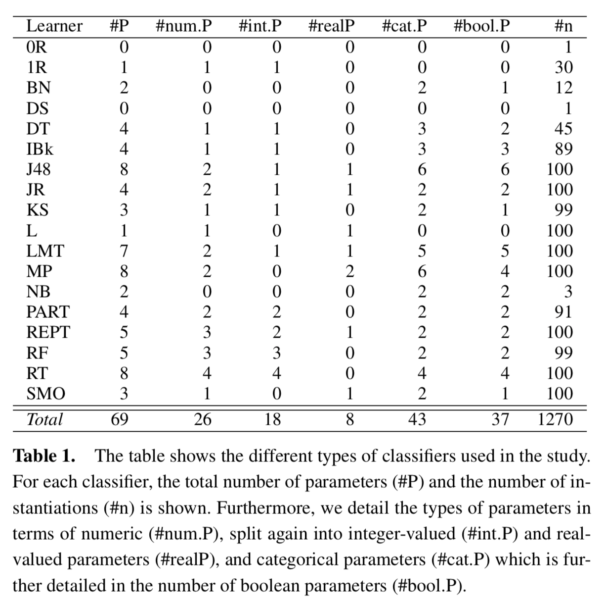

# Code for paper: Extreme Algorithm Selection with Dyadic Feature Representation

This repository holds the code for our paper "Extreme Algorithm Selection with Dyadic Feature Representation"
by Alexander Tornede, Marcel Wever and Eyke Hüllermeier. 

## Abstract
Algorithm selection (AS) deals with selecting an algorithm from a fixed set of candidate algorithms most suitable for a specific instance of an algorithmic problem, e.g., choosing solvers for SAT problems. Benchmark suites for AS usually comprise candidate sets consisting of at most tens of algorithms, whereas in combined algorithm selection and hyperparameter optimization problems the number of candidates becomes intractable, impeding to learn effective meta-models and thus requiring costly online performance evaluations.
Therefore, here we propose the setting of extreme algorithm selection (XAS) where we consider fixed sets of thousands of candidate algorithms, facilitating meta learning.
We assess the applicability of state-of-the-art AS techniques to the XAS setting and propose approaches leveraging a dyadic feature representation in which both problem instances and algorithms are described. We find the latter to improve significantly over the current state of the art in various metrics.

## Benchmark Dataset
We created a benchmark dataset with over 1200 machine learning classification algorithms represented by feature information and evaluated them on almost 68 classification datasets from the [OpenML CC-18 benchmark](https://docs.openml.org/benchmark/#openml-cc18). This dataset contains both feature information for algorithms and datasets. Furthermore, the accuracy of the classification algorithms on the datasets is reported. 

### Datasets
We used all datasets contained in the OpenML CC-18 benchmark, except for the ones with the IDs 40923,40927,40996,554. The first two were excluded for technical reasons as they yielded errors within our code due to formatting errors. The latter two were excluded since none of the algorithms were successfully evaluated within a time limit of 5 minutes.

Datasets are represented in terms of features by all 45 OpenML landmarkers, for which different configurations of the following learning algorithms are evaluated based on the error rate, area under the (ROC) curve, and Kappa coefficient: Naive Bayes, One-Nearest Neighbour, Decision Stump, Random Tree, REPTree and J48.

### Algorithms
As algorithms we used 18 classifiers from the Java machine learning library [WEKA](https://www.cs.waikato.ac.nz/ml/weka/): BayesNet (BN), DecisionStump (DS), DecisionTable (DT), IBk, J48, JRip (JR), KStar (KS), LMT, Logistic (L), MultilayerPerceptron (MP), NaiveBayes (NB), OneR (1R), PART, REPTree (REPT), RandomForest (RF), RandomTree (RT), SMO, ZeroR (0R).

An overview of these classifiers and their types of hyperparameters is given in the table below. The last row of the table sums up the items of the respective column, providing insights into the dimensionality of the space of potential candidate algorithms. From this space, we randomly sampled up to 100 distinct instantiations of each classifier, ensuring the instances being not too similar, yielding a set of 1270 candidate algorithms.



Candidate algorithms are represented in terms of features by using their hyperparameters, or more precisely the values of their hyperparameters. Assume that an algorithm family is defined by the different instantiations of an algorithm featuring several hyperparameters. For example, we consider support vector machines (SVM) as an algorithm family and different configurations of an SVM as members of this family. Then, given a set of algorithm families, e.g. `{SVM, random forests (RF), logistic regression (LOR)}`, we compute the union over the set of parameters of the algorithm families and create a vector with one entry per numerical parameter and as many entries per categorical parameter as needed to allow for a one-hot-encoding. Furthermore, the feature representation has a binary feature per algorithm family, indicating whether a given candidate algorithm comes from that family or not. Then, when given any candidate algorithm from a known algorithm family, we create the associated feature representation by setting each element in the vector to the respective parameter value while initializing the irrelevant ones with 0.

As an example, consider again the set of algorithm families `{SVM, RF, LOR}` and assume for simplicity that each of these families has only a single numerical parameter. Then, given an SVM instantiation a where the associated parameter is set to `0.4` a feature representation according to our technique could be `(1,0.4,0,0,0,0)`. The first two elements of the vector correspond to the SVM family of which the first element, i.e. the 1, indicates that a is an SVM instantiation and the second element corresponds to its parameter value 0.4.

### Performance Values
We evaluated each of the candidate algorithms described above on all of the datasets given above using a 5-fold cross validation. The measure we used is classification accuracy. Each evaluation was constrained by a timeout of 5 minutes. Evaluations which did not finish in time are represented by a negative value in the dataset.


### Download and Structure
The benchmark dataset can be downloaded from this Github repository: [benchmark_dataset](benchmark_dataset.zip). Be aware that it expands to over 300 MB during decompression. The structure of the files is as follows. 

The zip file contains three CSV files:
* dataset_metafeature_new.csv: Each line corresponds to a dataset from the OpenML benchmark and its associated metafeature representation. The first element in the line is the OpenML ID of the dataset whereas the second element is the feature representation described above.
* algorithm_metafeatures.csv: Each line corresponds to one of the over 1200 candidate algorithms. The first element gives an id of the algorithm which is described by the line, whereas the second one gives a textual representation of the candidate algorithm in the JSON format. The third and last element gives the feature representation of the associated algorithm as described earlier.
* algorithm_evaluations_with_timeouts.csv: Each line corresponds to an evaluation of an algorithm on a dataset. The first element gives the seed used for the evaluation, the second element gives the ID of the associated dataset, the third element gives the textual description of the algorithm used for the evaluation and the fourth element gives the ID of the algorithm which can be referred to to find it in the algorithm metafeature table. The fifth value gives the actual accuracy or a negative value if the evaluation timed out. The last value gives the stack-trace of any exception which occurred during the evaluation, i.e. timeout related exceptions.

## Execution Details (Getting The Code To Run)
For the sake of reproducibility, we will detail how to reproduce the results presented in the paper below. 

In order to reproduce the results by running our code, we assume that you have a MySQL server with version 5.7.9 running. It might also work with other versions, but we can only guarantee that our tables can be imported to that version. 

Using that database server, you have to create a new database with a name of your choice where you import the three sql dumps featuring three tables compressed in [sql_tables.zip](sql_tables.zip). These three tables correspond to the benchmark dataset we described earlier and represent the same information in the form of SQL tables instead CSV files.

As a next step, you have to create a configuration file entitled `experiment_runner.properties` in a `conf` folder either on the top level of your IDE project or next to the runnable jar. This configuration file should contain the following information:

```
## database settings
db.host = my.sqlserver.com
db.username = username
db.password = password
db.database = databasename
db.table = tableWhereToPutTheResults
db.ssl = true

amount_cpus=1 #amount of CPUs you want to use for parallization
folds_on_datasets=true
folds_on_algorithms=false

approaches = alors_regression,alors_ndcg,average_rank,average_performance,1-nn,2-nn,average_performance,1-nn,2-nn,dyad_ranking,per_algorithm_regression,dyadic_feature_regression,oracle,random

dataset_ids = 3, 40966, 6, 11, 12, 14, 15, 40975, 16, 18, 40978, 40979, 40982, 22, 23, 40983, 151, 40984, 1049, 1050, 28, 29, 1053, 31, 32, 40994, 37, 38, 4134, 1063, 1067, 1068, 44, 300, 46, 50, 307, 40499, 1461, 1462, 54, 182, 4534, 1590, 1464, 4538, 188, 6332, 1468, 1475, 41027, 1478, 1480, 458, 1485, 1486, 1487, 1489, 23381, 469, 1494, 1497, 40668, 1501, 23517, 40670, 1510, 40701
```

You have to adapt all entries starting with `db.` according to your database server setup. The entries have the following meaning:
* `db.host`: the address of your database server
* `db.username`: the username the code can use to access the database
* `db.password`: the password the code can use to access the database
* `db.database`: the name of the database where you imported the tables
* `db.table`: the name of the table, where results should be stored. This is created automatically by the code if it does not exist yet and should NOT be created manually.
* `db.ssl`: whether ssl should be used or not

Furthermore, the neural network used by the dyad ranking approach requires a configuration file with the following content entitled `plnet.properties` in the directory `conf/plNet`:
```
plnet.learningrate = 0.01
plnet.hidden.nodes = 50,50,30,20,20
plnet.seed = 1
plnet.hidden.activation.function = SIGMOID
plnet.epochs = 0
plnet.minibatch.size = 20
plnet.early.stopping.interval = 1
plnet.early.stopping.patience = 20
plnet.early.stopping.train.ratio = 0.8
plnet.early.stopping.retrain = true
```

### Obtaining Evaluation Results
After this file has been created, you can execute the main method of the class `de.upb.isml.tornede.ecai2020.experiments.evaluator.ExperimentRunnerEcai` in order to run all experiments which we performed for the paper. The results will be stored in the table given in the configuration file and has the following columns 

* `dataset_split`: The id of the split wrt. to the 10-fold cross-validation on the datasets
* `approach`: The name of the approach which is evaluated.
* `test_dataset_id`: The id of the test dataset for which the evaluation is performed.
* `ranking_to_test`: The id of the ranking to test. Recall that we sample 100 rankings of length 10 to compare against.
* `metric`: The name of the metric for which the result is reported.
* `metric_result`: The result of the evaluation.

In order to obtain the results reported in the paper, you have to group by approach and metric and aggregate the metric results. This can be easily done via an SQL query.

### Generating The Paper's Performance Table
For generating the exact performance table found in the paper, including the results of the performed significance tests, you have to run the main method of the `ai.libs.jaicore.basic.kvstore.ResultsTableGenerator`, which will output the latex code of the table on the console. Note that this generator does not query the database, but loads its values from a key-value store file in the data folder of the project storing an aggregation of the performance data obtained when running the approach.

## Configuration Details
The following configuration details did not find a spot within the paper: 
* The neural network we use to model the utility function for the dyad ranking approach is implemented in [DL4J](https://deeplearning4j.org/) and uses the parameters given in the configuration file called `plnet.properties` described earlier.
